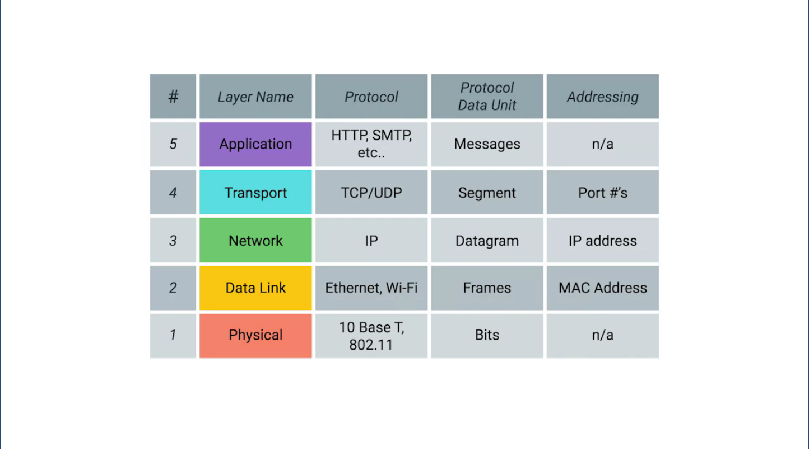

# Computer Networking

`What is the TCP/IP Five-Layer Network Model?`

A 5 layer stack comprised of the following layers

5. Application - protocols that are used for the applications your using
   (HTTPS for a browser, SMTP for a mail app, etc)
4. Transport - Sorts out which client and server programs are supposed
   to get that data
3. Network - Allows different networks to communicate with each other
   through devices known as routers
2. Data Link - Responsible for defining a common way of interpreting
   these signals so network devices can communicate
    * Ethernet is a common protocol used by the Data Link layer
1. Physical - Represents the physical devices that interconnect
   computers

<<<<<<< HEAD:networking/week1.md

=======

>>>>>>> a46d264520a34fe7ce4d44243375c8d33f8809b0:bitsAndBytesOfComputerNetworking/week1.md

`What is UDP and how is it different from TCP?`

* UDP stands for User Datagram Protocol, and differs from TCP by not providing mechanisms to ensure that data is reliably delivered.

`What is the OSI model and why is it important?`

* OSI stands for Open Systems Interconnection model and it describes
  seven layers that computer systems use to communicate over a network

7. Application Layer
  * The application layer is used by end-user software such as web
    browsers and email clients. It provides protocols that allow
    software to send and receive information and present meaningful data
    to users. A few examples of application layer protocols are the
    Hypertext Transfer Protocol (HTTP), File Transfer Protocol (FTP),
    Post Office Protocol (POP), Simple Mail Transfer Protocol (SMTP),
    and Domain Name System (DNS).

6. Presentation Layer
  * Presentation layer prepares data for the application layer. It defines how two devices should encode, encrypt, and compress data so it is received correctly on the other end. The presentation layer takes any data transmitted by the application layer and prepares it for transmission over the session layer.

5. Session Layer
  * The session layer creates communication channels, called sessions, between devices. It is responsible for opening sessions, ensuring they remain open and functional while data is being transferred, and closing them when communication ends. The session layer can also set checkpoints during a data transfer if the session is interrupted, devices can resume data transfer from the last checkpoint.

4. Transport Layer
  * Transport layer takes data transferred in the session layer and breaks it into "segments" on the transmitting end. It is responsible for reassembling the segments on the receiving end, turning it back into data that can be used by the session layer. The transport layer carries out flow control, sending data at a rate that matches the connection speed of the receiving device, and error control, checking if data was received incorrectly and if not, requesting it again.

3. Network Layer
  * The network layer has two main functions. One is breaking up segments into network packets, and reassembling the packets on the receiving end. The other is routing packets by discovering the best path across a physical network. The network layer uses network addresses (typically Internet Protocol addresses) to route packets to a destination node.

2. Data Link Layer
  * The data link layer establishes and terminates a connection between two physically-connected nodes on a network. It breaks up packets into frames and sends them from source to destination. This layer is composed of two parts---Logical Link Control (LLC), which identifies network protocols, performs error checking and synchronizes frames, and Media Access Control (MAC) which uses MAC addresses to connect devices and define permissions to transmit and receive data.

1. Physical Layer
  * The physical layer is responsible for the physical cable or wireless connection between network nodes. It defines the connector, the electrical cable or wireless technology connecting the devices, and is responsible for transmission of the raw data, which is simply a series of 0s and 1s, while taking care of bit rate control.

### Acronyms to remember the layers:
Please Do Not Throw Away Sausage Pizza - Bottom to Top (physical to Application)
All People Seem to Need Data Processing - Top to bottom

Ethernet is a Datalink layer level protocol.

`How are data transmitted across a copper wire?`
* Through a process called Modulation, which is a way of varying the
  voltage across the cable to send signals, when used for computer
  networks this type of modulation is called *Line Coding*

**Why are twisted pair cables twisted?**
* The twisting helps protect against electromagnetic interference and
  cross-talk from other cables.

