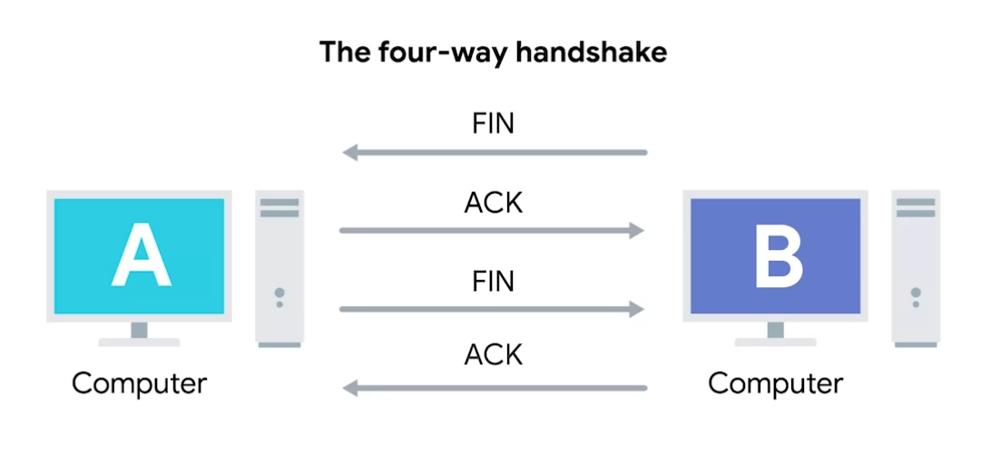

# Week 3 The Transport and Application Layers

`What does the transport layer do?`
* Allows traffic to be directed to specific network applications.

`What is the application layer and what does it do?`
* Allows applications to communicate in a way they understand.

`What is multiplexing/demultiplexing in the transport layer?`
* Multiplexing means that nodes on the network have the ability to
  direct traffic toward many different receiving services.
  * **DEF2** Gathering data from multiple application processes of the sender, enveloping that data with a header, and sending them as a whole to the intended receiver is called multiplexing.
* Demultiplexing is the same concept, except on the receiving end, its
  taking traffic that's all aimed at the same node and delivering it to
  the proper receiving service.
  * **DEF2** Delivering received segments at the receiver side to the correct app layer processes is called demultiplexing.
* The Transport layer is the only layer that can multiplex and
  demultiplex

`What is a port?`
* A 16-bit number that's used to direct traffic to specific services
  running on a networked computer.

`What is a socket address/socket number?`
* An IP address written with a port in it, denoted with a colon
  10.0.0.1**:80**

`What is a Source Port?`
* A high-numbered port chosen from a special section of ports known as
  ephemeral ports. A source port is required to keep lots of outgoing
  connections separate.

`What are the TCP control flags and what do they mean?`
* `URG` (urgent) | A value of one here indicates that he segment is
  considered urgent and that the urgent pointer field has more data
  about this.
* `ACK` (acknowledged) | A value of one in this field means that the
  acknowledgement number field should be examined
* `PSH` (push) | The transmitting device wants the receiving device to
  push currently-buffered data to the application on the receiving end
  as soon as possible
* `RST` (reset) | One of the sides in a TCP connection hasn't been able to
  properly recover from a series of missing or malformed segments
* `SYN` (synchronize) | It's used when first establishing a TCP connection
  and makes sure the receiving end knows to examine the sequence number
  field
* `FIN` (finished) | When this flag is set to one, it means the
  transmitting computer doesn't have any more data to send and the
  connection can be closed.

`What is a three-way handshake?`
* A handshake is a way for two devices to ensure that they're speaking the same
  protocol and will be able to understand each other. The three way
  handshake is a way to initially establish a TCP connection

`What is a four-way handshake?`
* A handshake that's meant to close the connection.

`What is a Socket?`
* The instantiation of an end-point in a potential TCP connection

`What is an instantiation?`
* The actual implementation of something defined elsewhere

`How is a port different from a socket?`
* A port is more of a virtual descriptive thing; you can send traffic to
  any port you want, but you're only going to get a response if a
  program has opened a socket on that port. 

`What are some common TCP socket states and what do they mean?`
* LISTEN | A TCP socket is ready and listening for incoming connections
* SYN_SENT | A synchronization request has been sent, but the connection
  hasn't been established yet
* SYN_RECEIVED | A socket previously in a LISTEN state has received a
  synchronization request and sent a SYN/ACK back
* ESTABLISHED | The TCP connection is in working order and both sides
  are free to send each other data
* FIN_WAIT | A FIN has been sent, but the corresponding ACK from the
  other end hasn't been received yet
* CLOSE_WAIT | The connection has been closed at the TCP layer, but
  that the application that opened the socket hasn't released its hold on the
  socket yet
* CLOSED | The connection has been fully terminated and that no
  communication is possible

`What is a Connection-oriented protocol?`
* Establishes a connection, and uses this to ensure that all data has
  been properly transmitted

  

